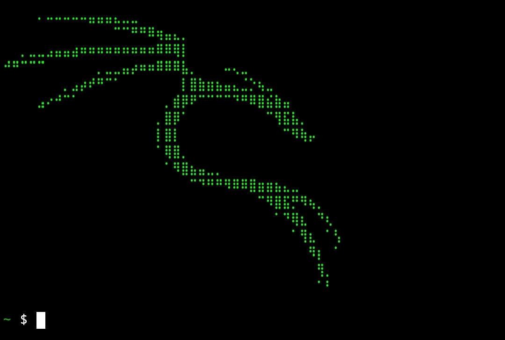

<!-- Gullkhan-->

<p align="center">
  
</p>

```
nano ~/.bashrc
```
```
#### Display ########################

echo -e "\e[0;37m" 
clear
echo
echo -e " \e[1;32m  ░██████╗░██╗░░░██╗██╗░░░░░██╗░░░░░  ██╗░░██╗██╗░░██╗░█████╗░███╗░░██╗ \e[0m"
echo -e " \e[1;32m  ██╔════╝░██║░░░██║██║░░░░░██║░░░░░  ██║░██╔╝██║░░██║██╔══██╗████╗░██║ \e[0m"
echo -e " \e[1;32m  ██║░░██╗░██║░░░██║██║░░░░░██║░░░░░  █████═╝░███████║███████║██╔██╗██║ \e[0m"
echo -e " \e[1;32m  ██║░░╚██╗██║░░░██║██║░░░░░██║░░░░░  ██╔═██╗░██╔══██║██╔══██║██║╚████║ \e[0m"
echo -e " \e[1;32m  ╚██████╔╝╚██████╔╝███████╗███████╗  ██║░╚██╗██║░░██║██║░░██║██║░╚███║ \e[0m"
echo -e " \e[1;32m  ░╚═════╝░░╚═════╝░╚══════╝╚══════╝ ╚═╝░░╚═╝╚═╝░░╚═╝╚═╝░░╚═╝╚═╝░░╚══╝  \e[0m"
echo
```
<p align="center">
  
</p>

```
echo -e "\e[1;32m"   # Green color
cat <<'ART'
⠀⠀⠀⠀⠠⠤⠤⠤⠤⠤⣤⣤⣤⣄⣀⣀⠀⠀⠀⠀⠀⠀⠀⠀⠀⠀⠀⠀⠀⠀⠀⠀⠀⠀⠀⠀⠀⠀⠀⠀
⠀⠀⠀⠀⠀⠀⠀⠀⠀⠀⠀⠀⠀⠉⠉⠛⠛⠿⢶⣤⣄⡀⠀⠀⠀⠀⠀⠀⠀⠀⠀⠀⠀⠀⠀⠀⠀⠀⠀⠀
⠀⠀⢀⣀⣀⣠⣤⣤⣴⠶⠶⠶⠶⠶⠶⠶⠶⠶⠿⠿⢿⡇⠀⠀⠀⠀⠀⠀⠀⠀⠀⠀⠀⠀⠀⠀⠀⠀⠀⠀
⠚⠛⠉⠉⠉⠀⠀⠀⠀⠀⠀⢀⣀⣀⣤⡴⠶⠶⠿⠿⠿⣧⡀⠀⠀⠀⠤⢄⣀⠀⠀⠀⠀⠀⠀⠀⠀⠀⠀⠀
⠀⠀⠀⠀⠀⠀⠀⢀⣠⡴⠞⠛⠉⠁⠀⠀⠀⠀⠀⠀⠀⢸⣿⣷⣶⣦⣤⣄⣈⡑⢦⣀⠀⠀⠀⠀⠀⠀⠀⠀
⠀⠀⠀⠀⣠⠔⠚⠉⠁⠀⠀⠀⠀⠀⠀⠀⠀⠀⠀⢀⣾⡿⠟⠉⠉⠉⠉⠙⠛⠿⣿⣮⣷⣤⠀⠀⠀⠀⠀⠀
⠀⠀⠀⠀⠀⠀⠀⠀⠀⠀⠀⠀⠀⠀⠀⠀⠀⠀⢀⣿⡿⠁⠀⠀⠀⠀⠀⠀⠀⠀⠀⠉⢻⣯⣧⡀⠀⠀⠀⠀
⠀⠀⠀⠀⠀⠀⠀⠀⠀⠀⠀⠀⠀⠀⠀⠀⠀⠀⢸⣿⡇⠀⠀⠀⠀⠀⠀⠀⠀⠀⠀⠀⠀⠉⠻⢷⡤⠀⠀⠀
⠀⠀⠀⠀⠀⠀⠀⠀⠀⠀⠀⠀⠀⠀⠀⠀⠀⠀⠈⢿⣿⡀⠀⠀⠀⠀⠀⠀⠀⠀⠀⠀⠀⠀⠀⠀⠀⠀⠀⠀
⠀⠀⠀⠀⠀⠀⠀⠀⠀⠀⠀⠀⠀⠀⠀⠀⠀⠀⠀⠈⠻⣿⣦⣤⣀⡀⠀⠀⠀⠀⠀⠀⠀⠀⠀⠀⠀⠀⠀⠀
⠀⠀⠀⠀⠀⠀⠀⠀⠀⠀⠀⠀⠀⠀⠀⠀⠀⠀⠀⠀⠀⠀⠉⠙⠛⠛⠻⠿⠿⣿⣶⣶⣦⣄⣀⠀⠀⠀⠀⠀
⠀⠀⠀⠀⠀⠀⠀⠀⠀⠀⠀⠀⠀⠀⠀⠀⠀⠀⠀⠀⠀⠀⠀⠀⠀⠀⠀⠀⠀⠀⠉⠻⣿⣯⡛⠻⢦⡀⠀⠀
⠀⠀⠀⠀⠀⠀⠀⠀⠀⠀⠀⠀⠀⠀⠀⠀⠀⠀⠀⠀⠀⠀⠀⠀⠀⠀⠀⠀⠀⠀⠀⠀⠈⠙⢿⣆⠀⠙⢆⠀
⠀⠀⠀⠀⠀⠀⠀⠀⠀⠀⠀⠀⠀⠀⠀⠀⠀⠀⠀⠀⠀⠀⠀⠀⠀⠀⠀⠀⠀⠀⠀⠀⠀⠀⠈⢻⣆⠀⠈⢣
⠀⠀⠀⠀⠀⠀⠀⠀⠀⠀⠀⠀⠀⠀⠀⠀⠀⠀⠀⠀⠀⠀⠀⠀⠀⠀⠀⠀⠀⠀⠀⠀⠀⠀⠀⠀⠻⡆⠀⠈
⠀⠀⠀⠀⠀⠀⠀⠀⠀⠀⠀⠀⠀⠀⠀⠀⠀⠀⠀⠀⠀⠀⠀⠀⠀⠀⠀⠀⠀⠀⠀⠀⠀⠀⠀⠀⠀⢻⡀⠀
⠀⠀⠀⠀⠀⠀⠀⠀⠀⠀⠀⠀⠀⠀⠀⠀⠀⠀⠀⠀⠀⠀⠀⠀⠀⠀⠀⠀⠀⠀⠀⠀⠀⠀⠀⠀⠀⠈⠃⠀
ART
echo -e "\e[0m"

```
