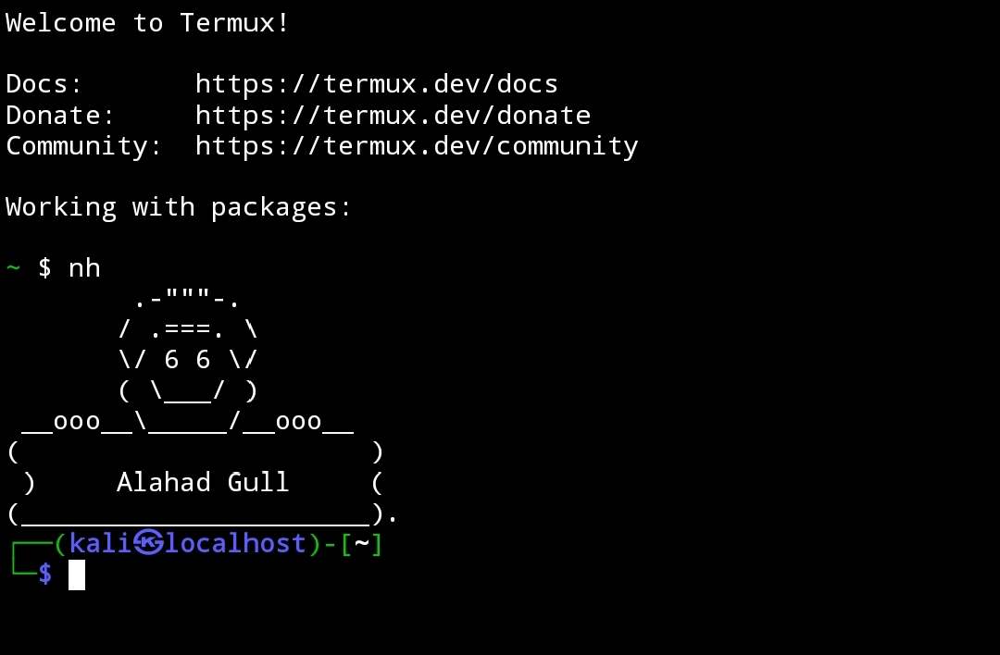

<!-- Gullkhan-->  

### Termux Terminal                                                                       
A Termux banner refers to a custom, personalized message or graphic that appears every time the Termux terminal application is opened on an Android device. It's a way for users to customize their Termux environment and make it more visually appealing or informative. <p align="center"></p>

### Command for Termux 
```
nano ~/.bashrc
```
### Command for Kali Linux 
```
nano ~/.zshrc
```
### 
```
#### Display ########################

echo -e "\e[0;37m" 
clear
echo
echo -e " \e[1;32m  ░██████╗░██╗░░░██╗██╗░░░░░██╗░░░░░  ██╗░░██╗██╗░░██╗░█████╗░███╗░░██╗ \e[0m"
echo -e " \e[1;32m  ██╔════╝░██║░░░██║██║░░░░░██║░░░░░  ██║░██╔╝██║░░██║██╔══██╗████╗░██║ \e[0m"
echo -e " \e[1;32m  ██║░░██╗░██║░░░██║██║░░░░░██║░░░░░  █████═╝░███████║███████║██╔██╗██║ \e[0m"
echo -e " \e[1;32m  ██║░░╚██╗██║░░░██║██║░░░░░██║░░░░░  ██╔═██╗░██╔══██║██╔══██║██║╚████║ \e[0m"
echo -e " \e[1;32m  ╚██████╔╝╚██████╔╝███████╗███████╗  ██║░╚██╗██║░░██║██║░░██║██║░╚███║ \e[0m"
echo -e " \e[1;32m  ░╚═════╝░░╚═════╝░╚══════╝╚══════╝ ╚═╝░░╚═╝╚═╝░░╚═╝╚═╝░░╚═╝╚═╝░░╚══╝  \e[0m"
echo
```
### Output 👇🏻
<p align="center">
  
</p>

### Next 
```
echo -e "\e[1;32m"   # Green color
cat <<'ART'
⠀⠀⠀⠀⠠⠤⠤⠤⠤⠤⣤⣤⣤⣄⣀⣀⠀⠀⠀⠀⠀⠀⠀⠀⠀⠀
⠀⠀⠀⠀⠀⠀⠀⠀⠀⠀⠀⠀⠀⠀
⠀⠀⠀⠀⠀⠀⠀⠀⠀⠀⠀⠀⠀⠉⠉⠛⠛⠿⢶⣤⣄⡀⠀⠀⠀⠀⠀⠀⠀⠀⠀⠀⠀⠀⠀⠀⠀⠀⠀⠀
⠀⠀⢀⣀⣀⣠⣤⣤⣴⠶⠶⠶⠶⠶⠶⠶⠶⠶⠿⠿⢿⡇⠀⠀⠀⠀⠀⠀⠀⠀⠀⠀⠀⠀⠀⠀⠀⠀⠀⠀
⠚⠛⠉⠉⠉⠀⠀⠀⠀⠀⠀⢀⣀⣀⣤⡴⠶⠶⠿⠿⠿⣧⡀⠀⠀⠀⠤⢄⣀⠀⠀⠀⠀⠀⠀⠀⠀⠀⠀⠀
⠀⠀⠀⠀⠀⠀⠀⢀⣠⡴⠞⠛⠉⠁⠀⠀⠀⠀⠀⠀⠀⢸⣿⣷⣶⣦⣤⣄⣈⡑⢦⣀⠀⠀⠀⠀⠀⠀⠀⠀
⠀⠀⠀⠀⣠⠔⠚⠉⠁⠀⠀⠀⠀⠀⠀⠀⠀⠀⠀⢀⣾⡿⠟⠉⠉⠉⠉⠙⠛⠿⣿⣮⣷⣤⠀⠀⠀⠀⠀⠀
⠀⠀⠀⠀⠀⠀⠀⠀⠀⠀⠀⠀⠀⠀⠀⠀⠀⠀⢀⣿⡿⠁⠀⠀⠀⠀⠀⠀⠀⠀⠀⠉⢻⣯⣧⡀⠀⠀⠀⠀
⠀⠀⠀⠀⠀⠀⠀⠀⠀⠀⠀⠀⠀⠀⠀⠀⠀⠀⢸⣿⡇⠀⠀⠀⠀⠀⠀⠀⠀⠀⠀⠀⠀⠉⠻⢷⡤⠀⠀⠀
⠀⠀⠀⠀⠀⠀⠀⠀⠀⠀⠀⠀⠀⠀⠀⠀⠀⠀⠈⢿⣿⡀⠀⠀⠀⠀⠀⠀⠀⠀⠀⠀⠀⠀⠀⠀⠀⠀⠀⠀
⠀⠀⠀⠀⠀⠀⠀⠀⠀⠀⠀⠀⠀⠀⠀⠀⠀⠀⠀⠈⠻⣿⣦⣤⣀⡀⠀⠀⠀⠀⠀⠀⠀⠀⠀⠀⠀⠀⠀⠀
⠀⠀⠀⠀⠀⠀⠀⠀⠀⠀⠀⠀⠀⠀⠀⠀⠀⠀⠀⠀⠀⠀⠉⠙⠛⠛⠻⠿⠿⣿⣶⣶⣦⣄⣀⠀⠀⠀⠀⠀
⠀⠀⠀⠀⠀⠀⠀⠀⠀⠀⠀⠀⠀⠀⠀⠀⠀⠀⠀⠀⠀⠀⠀⠀⠀⠀⠀⠀⠀⠀⠉⠻⣿⣯⡛⠻⢦⡀⠀⠀
⠀⠀⠀⠀⠀⠀⠀⠀⠀⠀⠀⠀⠀⠀⠀⠀⠀⠀⠀⠀⠀⠀⠀⠀⠀⠀⠀⠀⠀⠀⠀⠀⠈⠙⢿⣆⠀⠙⢆⠀
⠀⠀⠀⠀⠀⠀⠀⠀⠀⠀⠀⠀⠀⠀⠀⠀⠀⠀⠀⠀⠀⠀⠀⠀⠀⠀⠀⠀⠀⠀⠀⠀⠀⠀⠈⢻⣆⠀⠈⢣
⠀⠀⠀⠀⠀⠀⠀⠀⠀⠀⠀⠀⠀⠀⠀⠀⠀⠀⠀⠀⠀⠀⠀⠀⠀⠀⠀⠀⠀⠀⠀⠀⠀⠀⠀⠀⠻⡆⠀⠈
⠀⠀⠀⠀⠀⠀⠀⠀⠀⠀⠀⠀⠀⠀⠀⠀⠀⠀⠀⠀⠀⠀⠀⠀⠀⠀⠀⠀⠀⠀⠀⠀⠀⠀⠀⠀⠀⢻⡀⠀
⠀⠀⠀⠀⠀⠀⠀⠀⠀⠀⠀⠀⠀⠀⠀⠀⠀⠀⠀⠀⠀⠀⠀⠀⠀⠀⠀⠀⠀⠀⠀⠀⠀⠀⠀⠀⠀⠈⠃⠀
ART
echo -e "\e[0m"

```
### Output 👇🏻
<p align="center">
  
</p>

### Next 

```
clear
count=0
while [ $count -lt 20 ]; do  # Change 20 to increase duration
  for color in 31 33 32 36 34 35 91; do
    echo -e "\e[1;${color}m"
    cat <<'EOF'
⠀⠀⠀⠀⠠⠤⠤⠤⠤⠤⣤⣤⣤⣄⣀⣀⠀⠀⠀⠀⠀⠀⠀⠀⠀⠀⠀⠀⠀⠀⠀⠀⠀⠀⠀⠀⠀⠀⠀⠀
⠀⠀⠀⠀⠀⠀⠀⠀⠀⠀⠀⠀⠀⠉⠉⠛⠛⠿⢶⣤⣄⡀⠀⠀⠀⠀⠀⠀⠀⠀⠀⠀⠀⠀⠀⠀⠀⠀⠀⠀
⠀⠀⢀⣀⣀⣠⣤⣤⣴⠶⠶⠶⠶⠶⠶⠶⠶⠶⠿⠿⢿⡇⠀⠀⠀⠀⠀⠀⠀⠀⠀⠀⠀⠀⠀⠀⠀⠀⠀⠀
⠚⠛⠉⠉⠉⠀⠀⠀⠀⠀⠀⢀⣀⣀⣤⡴⠶⠶⠿⠿⠿⣧⡀⠀⠀⠀⠤⢄⣀⠀⠀⠀⠀⠀⠀⠀⠀⠀⠀⠀
⠀⠀⠀⠀⠀⠀⠀⢀⣠⡴⠞⠛⠉⠁⠀⠀⠀⠀⠀⠀⠀⢸⣿⣷⣶⣦⣤⣄⣈⡑⢦⣀⠀⠀⠀⠀⠀⠀⠀⠀
⠀⠀⠀⠀⣠⠔⠚⠉⠁⠀⠀⠀⠀⠀⠀⠀⠀⠀⠀⢀⣾⡿⠟⠉⠉⠉⠉⠙⠛⠿⣿⣮⣷⣤⠀⠀⠀⠀⠀⠀
⠀⠀⠀⠀⠀⠀⠀⠀⠀⠀⠀⠀⠀⠀⠀⠀⠀⠀⢀⣿⡿⠁⠀⠀⠀⠀⠀⠀⠀⠀⠀⠉⢻⣯⣧⡀⠀⠀⠀⠀
⠀⠀⠀⠀⠀⠀⠀⠀⠀⠀⠀⠀⠀⠀⠀⠀⠀⠀⢸⣿⡇⠀⠀⠀⠀⠀⠀⠀⠀⠀⠀⠀⠀⠉⠻⢷⡤⠀⠀⠀
⠀⠀⠀⠀⠀⠀⠀⠀⠀⠀⠀⠀⠀⠀⠀⠀⠀⠀⠈⢿⣿⡀⠀⠀⠀⠀⠀⠀⠀⠀⠀⠀⠀⠀⠀⠀⠀⠀⠀⠀
⠀⠀⠀⠀⠀⠀⠀⠀⠀⠀⠀⠀⠀⠀⠀⠀⠀⠀⠀⠈⠻⣿⣦⣤⣀⡀⠀⠀⠀⠀⠀⠀⠀⠀⠀⠀⠀⠀⠀⠀
⠀⠀⠀⠀⠀⠀⠀⠀⠀⠀⠀⠀⠀⠀⠀⠀⠀⠀⠀⠀⠀⠀⠉⠙⠛⠛⠻⠿⠿⣿⣶⣶⣦⣄⣀⠀⠀⠀⠀⠀
⠀⠀⠀⠀⠀⠀⠀⠀⠀⠀⠀⠀⠀⠀⠀⠀⠀⠀⠀⠀⠀⠀⠀⠀⠀⠀⠀⠀⠀⠀⠉⠻⣿⣯⡛⠻⢦⡀⠀⠀
⠀⠀⠀⠀⠀⠀⠀⠀⠀⠀⠀⠀⠀⠀⠀⠀⠀⠀⠀⠀⠀⠀⠀⠀⠀⠀⠀⠀⠀⠀⠀⠀⠈⠙⢿⣆⠀⠙⢆⠀
⠀⠀⠀⠀⠀⠀⠀⠀⠀⠀⠀⠀⠀⠀⠀⠀⠀⠀⠀⠀⠀⠀⠀⠀⠀⠀⠀⠀⠀⠀⠀⠀⠀⠀⠈⢻⣆⠀⠈⢣
⠀⠀⠀⠀⠀⠀⠀⠀⠀⠀⠀⠀⠀⠀⠀⠀⠀⠀⠀⠀⠀⠀⠀⠀⠀⠀⠀⠀⠀⠀⠀⠀⠀⠀⠀⠀⠻⡆⠀⠈
⠀⠀⠀⠀⠀⠀⠀⠀
EOF
    echo -e "\e[0m"
    sleep 0.2
    clear
  done
  count=$((count+1))
done
echo -e "\e[32m✨ Flicker Finished — Welcome back, Hacker! 😎\e[0m"
```
### Output 👇🏻
<p align="center">
  
</p>
